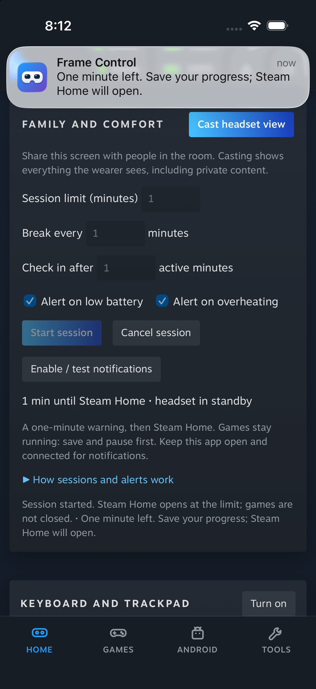

# Family and comfort: locked real-Frame verification

**Verified 2026-09-29**, tested feature source at `be1ab12`, SteamOS 0.4.1 build
`20260925.6191901`, iOS 26.5 Simulator. The test acquired
`/tmp/frame-test.lock` before deploying or launching anything.

The Simulator installed the bundled server in the Frame user account, connected
over its SSH tunnel, requested notification permission, displayed a native test
banner, and started a one-minute session through the shared UI API. The real
session warning reached the Simulator as a native banner. Steam Home opened
**60.76 seconds after the successful warning**. The running-app list was empty
before and after; this run does not prove preservation of a running game.

[Recorded session and cleanup result](comfort-session-20260929.json).
Local raw logs and headset/Simulator captures are retained at
`/tmp/frame-comfort-evidence/locked-run/` on the verification Mac.

**Verified cleanup:** previous page and hidden-dashboard state restored; comfort
worker and phone server exited; temporary Simulator SSH key removed; test lock
released; only the owned Simulator shut down. Battery stayed at 100%. No global
settings, power state, Steam or SteamVR lifecycle changes were made.

**Unverified while unworn:** SteamVR activity was 3 (standby), so active-use
break/check-in clocks stayed at zero. Headset captures returned blank standby
frames. The casting shortcut was invoked, but this run does not establish
visible output or frame rate. No low-battery or overheating condition was
induced. Earlier worn/active-device results remain separately documented in
[Family and comfort](../family-comfort.md).
