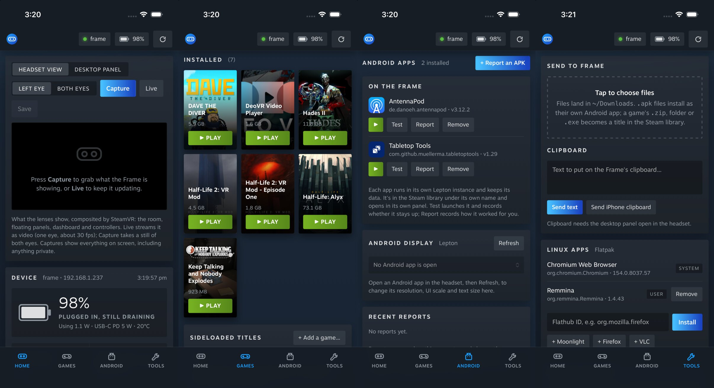

# Frame Control for iPhone

The iPhone (and iPad) app does what the desktop app does, from the phone:
headset view and live video, battery and status, screenshots, Steam games,
Android apps and their display settings, sideloading, files, clipboard,
Flatpaks, and power. Source: [`ios/`](../ios).

## How it works

An iPhone can't run Python or `ssh`, but the Frame can. So the app:

1. connects to the Frame over SSH itself (the [Citadel](https://github.com/orlandos-nl/Citadel)
   Swift SSH library), with its own ed25519 key from the Keychain;
2. copies Frame Control's server and helpers (`ios/scripts/make_frame_bundle.py`,
   under 1 MB) to `~/.cache/frame-control/<version>` on the Frame, once per version;
3. starts `ui/server.py` there with `FRAME_LOCAL=1`. It listens only on the
   Frame's own 127.0.0.1, and it stops when the phone disconnects (`--exit-on-eof`);
4. tunnels to it through the SSH session and shows the same page as the desktop
   app, in a web view. The page carries a fresh key each session, which the
   server requires on every request.

With `FRAME_LOCAL=1`, every `ssh frame COMMAND` the server runs goes to
`ui/local-bin/ssh`, which runs the command on the Frame directly (rsync uses it
as its transport too), so the desktop and phone share one code path. Android
display settings use `podman exec` into each Lepton container instead of adb,
which the Frame doesn't have.

Nothing is left running on the Frame after the phone disconnects; the copied
files stay in `~/.cache/frame-control` (delete it any time).

## Pairing

On the Frame, turn on Developer Mode and set a user password (Steam Settings →
System, then Developer → Set User Password). In the app, enter the headset's
address (`frame.local`, its IP, or its Tailscale name) and that password once.
The app adds its own key to `~/.ssh/authorized_keys` and remembers the Frame's
host key; the password isn't saved. If you already reach the Frame over SSH,
**Or add the key yourself** shows the phone's key to paste into
`authorized_keys`, and connects without a password.

Valve's tap-to-approve devkit pairing isn't used: it only takes RSA keys, and
the Frame's OpenSSH 9.7 rejects the SHA-1 RSA signatures the Swift SSH library
makes.

## What's different on the phone

| Desktop | iPhone |
|---|---|
| Drop files anywhere | Tap **Send to Frame** (or Add a game) and pick files; folders need zipping |
| Screenshots save to `~/Pictures/SteamFrame` | Save opens the share sheet: Save Image puts it in Photos |
| SSH and SFTP open a terminal | They open an app that handles `ssh://` / `sftp://` (Blink Shell, Termius) |
| Steam Link, remote desktop | Open the Steam Link and Windows App apps |
| Sleep, restart, shut down ask in a terminal | The page asks for the Developer Mode password |
| Compatibility reports kept on the computer | Kept on the Frame (`~/.local/share/Frame Control`) |

## Building

```sh
cd ios
xcodegen generate          # after changing project.yml
open FrameControl.xcodeproj
```

The build packs the Frame bundle from the checkout, so the phone always runs
the page and server from the same commit. Running on a phone needs your own
signing team in Xcode (Signing & Capabilities).

## Verified



In the iOS Simulator (iOS 26.5) against a real Frame, 2026-09-27: the app connected
with its key, copied the bundle over SFTP, started the server on the Frame and
showed all four tabs with live data. In the app's web view, Capture returned a
headset still and Live played H.264 video at 31 fps (WebCodecs works in
WKWebView). Through the app's tunnel: status, games, Steam library, Android apps,
screenshots, a file upload (checked on the Frame), a background install job, and
the power password check (a wrong password is refused). The server on the Frame
exits within seconds of the app closing.

Against Valve's own Steam Frame OS (SteamOS 0.3.0 build 20260922.5152327, the
`rootfs-A` partition of the Frame recovery image, run with its own sshd; see
[tests/frame-container](../tests/frame-container)), and a Holo Core stand-in:
pairing with the password (key added with the right
permissions, host key pinned, password stored nowhere), the power password
check (a wrong or missing password refused; the right one reaches `systemctl`),
a changed host key refused with "Pair with the Frame again", and a wrong
pairing password reported the same way.

Not yet exercised: Android display changes through podman (no Android app was
running), a real sleep/restart/shut down on the Frame, and a physical iPhone.

Debug builds have Simulator test hooks (`FRAME_TEST_HOST`, `FRAME_TEST_PAGE`,
`FRAME_TEST_JS`, and the tunnel URL in the app's Caches folder); release builds
don't.
